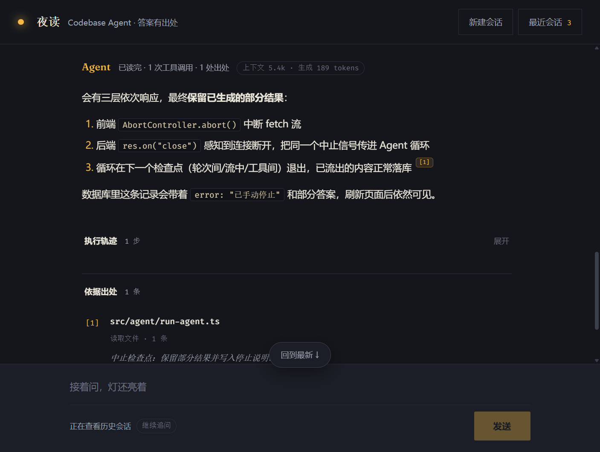
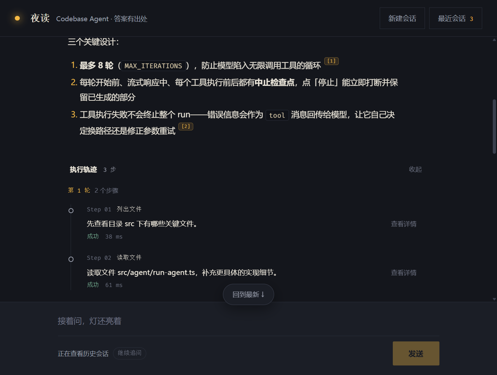
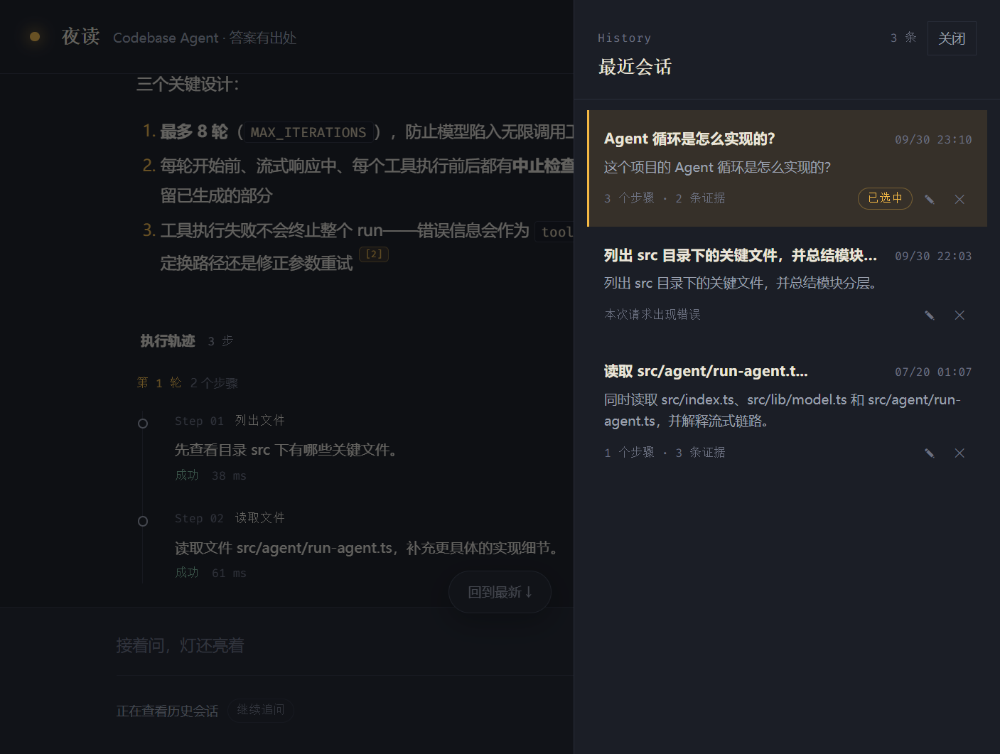
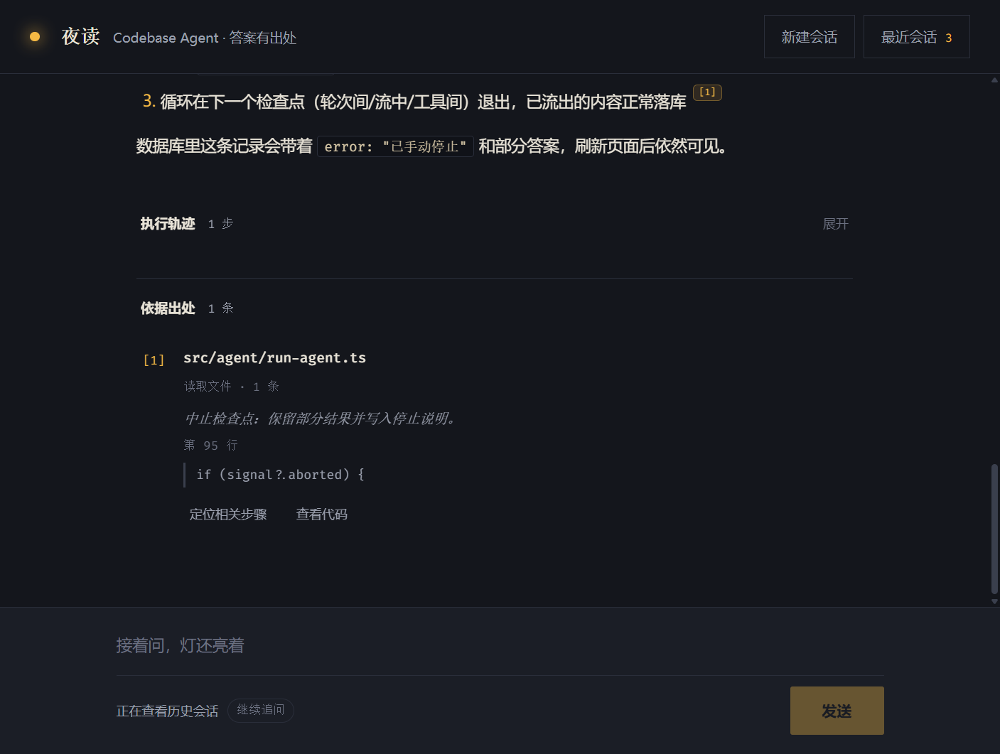

# Codebase QA Agent

[](https://github.com/Ace-Rider/Codebase-QA-Agent/actions/workflows/ci.yml)

一个面向本地代码仓库的智能问答 Agent。

用户在前端输入自然语言问题后，系统会结合大模型与本地代码检索工具，对当前项目进行多轮分析，并将答案生成过程、工具调用轨迹、引用文件和最终结果实时展示在页面中。

这个项目不是“聊天框 + 模型接口”的简单拼接，而是一个包含工具调用、流式输出、会话持久化和可视化执行轨迹的完整 Agent Demo。

## 界面预览

深色「夜读」主题：台灯即 Agent 状态（空闲微光 / 工作呼吸 / 出错变红），回答内的脚注标记可点击跳转到对应出处。

| 回答与出处                                         | 执行轨迹                                        |
| -------------------------------------------------- | ----------------------------------------------- |
|  |  |

| 历史会话                                          | 移动端                                         |
| ------------------------------------------------- | ---------------------------------------------- |
|  |  |

## 项目特点

- 支持围绕本地代码仓库进行自然语言问答
- 支持模型自主决定是否调用工具，工具失败自动回传模型自我修正
- 支持多轮 Agent 推理与工具调用循环（最多 8 轮，带护栏）
- 支持答案内容逐段流式输出，可随时中止并保留部分结果
- 支持长对话上下文压缩：超过阈值时摘要早期消息，数据库仍保留全量
- 支持 token 用量统计：每轮显示上下文规模与生成消耗
- 支持工具执行状态、参数、结果的可视化展示（按 Agent 轮次分组）
- 支持引用文件追踪与代码行级预览，回答内的脚注标记可点击跳转
- 支持基于会话的连续追问、历史会话持久化、重命名与删除

## 核心能力

当前项目内置了 4 个本地工具：

- `list_files`：列出目录下的文件结构（自动跳过 node_modules/dist 等，带条数上限）
- `grep_files`：搜索目录中的关键词匹配结果
- `read_file`：读取单个文本文件内容，支持 `offset`/`limit` 按行号范围读取（先 grep 定位、再按范围读，避免大文件撑爆上下文）
- `read_multiple_files`：一次读取多个文件，便于横向对比分析

Agent 会根据用户问题决定是否需要先调用工具。当模型返回 `tool_calls` 后，后端执行工具，将结果回填到消息上下文中，再继续发起下一轮模型请求，直到模型具备足够信息输出最终回答。工具执行出错不会终止整个流程，错误信息会作为工具结果回传给模型自行修正。

## 项目架构

### 后端

- `Express` 提供接口与 SSE 流式输出能力
- `OpenAI-compatible Chat Completions API`（原生 `fetch` 直连，手工解析 SSE 流并合并 tool_calls 增量分片）
- `Prisma + SQLite` 负责会话、轮次与消息持久化（启动时自动建表/迁移）
- `fast-glob` 和文件系统工具负责本地代码检索

### 前端

- `React + TypeScript` 构建交互界面（深色「夜读」设计系统）
- `Vite` 作为前端开发与构建工具
- `react-markdown + remark-gfm + rehype-highlight` 渲染 Markdown 答案（懒加载 + 按需语言注册，主包体积 -59%）
- 流式渲染采用 rAF 批量合并提交，避免每个 delta 触发重渲染

## 架构总览

```txt
┌────────────────────────── 浏览器 ──────────────────────────┐
│  React（夜读 UI）                                          │
│  useChatStream ── SSE 消费 ── rAF 批量提交流式渲染          │
│  MessageThread / StepsPanel / CitationsPanel / History     │
└───────────────┬───────────────────────────▲───────────────┘
        POST /api/chat/stream               │ GET /api/conversations
        （fetch + AbortController）          │ GET /api/files?path=
┌───────────────▼───────────────────────────┴───────────────┐
│  Express（端口 3001）                                       │
│                                                             │
│  runAgentStream（最多 8 轮工具循环，全链路可中止）           │
│    │                                                        │
│    ├── lib/model.ts ──► OpenAI 兼容接口（原生 fetch + SSE）  │
│    │      tool_calls 分片合并 / usage 提取                  │
│    │                                                        │
│    ├── run-tool.ts ──► list_files / grep_files /            │
│    │                    read_file(offset,limit) /           │
│    │                    read_multiple_files                 │
│    │      （workspace 沙箱：禁止越出项目根目录）             │
│    │                                                        │
│    └── normalizeResult ──► steps 格式化 + citations 提取    │
│                                                             │
│  session-store ──► Prisma + SQLite                          │
│    Conversation → Turn → Message（append-only）             │
│    消息链 > 60 条时上下文压缩（切点在 user 边界）            │
└─────────────────────────────────────────────────────────────┘
```

## 工作流程

1. 用户在前端输入问题。
2. 前端调用 `POST /api/chat/stream`，携带 `message` 和 `sessionId`。
3. 后端将本轮用户问题追加到当前会话消息中；若消息链超过 60 条，先触发上下文压缩（把早期消息摘要成一条，切点选在 user 消息边界，数据库仍保留全量）。
4. 后端调用模型流式接口，并持续接收 `content` 与 `tool_calls` 增量。
5. 若模型需要工具：
   - 后端执行对应工具
   - 将工具结果写回会话消息
   - 向前端推送工具步骤和状态事件
   - 继续进入下一轮模型调用
6. 若模型已具备足够信息：
   - 后端整理最终结果
   - 返回标准化的 `answer / steps / citations / token_usage / error`
   - 将结果持久化到本地数据库
7. 前端基于 SSE 逐步渲染答案、步骤和最终结果。
8. 任一时刻用户点击「停止」或关闭页面：AbortController 贯穿前后端中止 Agent 循环，已生成的部分结果保留。

## 流式事件设计

后端不会把原始模型协议直接暴露给前端，而是转换成更稳定的 UI 事件流：

```ts
type StreamEvent =
  | { type: "status"; message: string }
  | { type: "answer_delta"; delta: string }
  | { type: "answer_reset" }
  | { type: "step"; step: Step }
  | { type: "final"; result: ChatResponse }
  | { type: "error"; error: string };
```

其中：

- `answer_delta` 用于前端逐段拼接答案，实现“边生成边显示”
- `answer_reset` 用于模型先输出解释、后决定调用工具时清空临时内容
- `step` 用于展示工具调用轨迹
- `final` 用于统一落库和渲染最终结果

## 返回结果结构

```ts
type ChatResponse = {
  answer: string;
  steps: Step[]; // 工具调用轨迹（含轮次、耗时、参数、结果）
  citations: Citation[]; // 从工具轨迹自动提取的引用证据
  token_usage: {
    // 本轮 token 消耗（可为空）
    prompt_tokens: number; // 最后一轮请求的上下文规模
    completion_tokens: number; // 本轮全部生成消耗（跨迭代累计）
  } | null;
  error: string | null;
};
```

这种标准化结构可以让前端不必关心底层模型协议细节，只聚焦于渲染答案、证据和执行过程。

## 会话与数据持久化

项目已接入 `Prisma + SQLite`，本地会话并非只保存在内存中。数据模型为 `Conversation → Turn → Message` 三层：每个会话包含多轮问答（Turn），每轮的完整消息链路（含 tool_calls）以 append-only 方式写入，不做全量重建。

当前会持久化的数据包括：

- 会话标题（支持重命名）
- 每轮的用户提问、最终答案、工具步骤、引用信息与 token 用量
- 完整消息链路（支持在已有上下文基础上继续追问）

这使得项目具备以下能力：

- 刷新页面后仍可查看历史会话
- 支持按会话回看完整的多轮问答时间线
- 支持删除会话（级联清理轮次与消息）
- 支持在已有上下文基础上继续追问

## 前端展示内容

前端为对话式线程布局（深色「夜读」主题），主要包含：

- 顶栏：台灯状态指示器（空闲微光 / 工作中呼吸 / 出错变红）
- 消息线程：每轮包含提问气泡、流式渲染的回答、可折叠的执行轨迹（按 Agent 轮次分组）与「依据出处」脚注区
- 引用交互：回答内 `[1]` `[2]` 脚注可点击，滚动定位到对应出处条目；出处条目可展开带行号高亮的代码预览
- 底部输入区：提交问题、停止生成、会话状态
- 历史抽屉：会话列表，支持重命名与删除

流式渲染基于 `answer_delta` 事件，增量先缓冲、再由 rAF 每帧合并提交一次，避免高频重渲染。

## 技术栈

- Node.js
- TypeScript
- Express
- OpenAI-compatible API（原生 fetch + SSE 手工解析）
- React
- Vite
- Prisma
- SQLite
- fast-glob
- SSE
- Vitest

## 项目结构

```txt
src/
  index.ts                  # Express 服务入口（SSE、会话 CRUD、文件预览 API）
  lib/
    model.ts                # 模型流式调用、tool_calls 合并、usage 提取
    prisma.ts               # Prisma 客户端（启动时自动建表/迁移）
  agent/
    run-agent.ts            # 多轮 Agent 调度：循环、中止、用量累计、上下文压缩
    run-tool.ts             # 工具执行分发
    session-store.ts        # 会话/轮次/消息持久化与历史读取
  tools/
    list-files.ts           # 列出文件（ignore 过滤 + 上限）
    grep-files.ts           # 关键词检索（ignore 过滤）
    read-file.ts            # 读取文件（支持 offset/limit 行号范围）
    workspace.ts            # 工作目录沙箱
    normalizeResult.ts      # 结果标准化（步骤格式化、引用提取）

prisma/
  schema.prisma             # 数据库模型（Conversation/Turn/Message）

tests/                      # Vitest 单测（SSE 解析、Agent 循环、压缩、行号范围）

web/
  src/
    App.tsx                 # 应用骨架与灯状态指示器
    hooks/useChatStream.ts  # SSE 消费 + rAF 批量流式渲染 + 会话管理
    services/chat.ts        # API 封装
    components/
      MessageThread.tsx     # 消息线程（轮次、脚注跳转）
      MarkdownAnswer.tsx    # Markdown 渲染（懒加载、语法高亮、脚注按钮）
      StepsPanel.tsx        # 执行轨迹（按轮次分组）
      CitationsPanel.tsx    # 依据出处（脚注编号、代码预览）
      HistorySidebar.tsx    # 历史抽屉（重命名/删除）
      ChatInput.tsx         # 输入区（发送/停止）
```

## 本地运行

### 1. 安装依赖

```bash
npm install
```

### 2. 配置环境变量

在项目根目录创建 `.env` 文件：

```env
AI_API_KEY=your_api_key
AI_BASE_URL=https://your-compatible-openai-base-url/v1
AI_MODEL=your_model_name
DATABASE_URL="file:./prisma/dev.db"

# 可选：让 Agent 分析你自己的项目（不配置则默认分析本仓库自身）
# WORKSPACE_ROOT=C:\path\to\your\project
```

配置 `WORKSPACE_ROOT` 后，Agent 的文件工具沙箱会切换到指定目录——顶栏会显示「正在读 · 项目名」，你可以直接对自己的代码库提问。

### 3. 启动开发环境

```bash
npm run dev
```

默认会同时启动：

- 后端服务：`http://localhost:3001`
- 前端开发服务：`http://localhost:5173`

### 4. 运行测试

```bash
npm test
```

覆盖 SSE 流解析、tool_calls 分片合并、Agent 循环（工具回填/错误回传/用量累计/中止）、上下文压缩与 read_file 行号范围。

### 5. 类型检查

```bash
npm run typecheck
```

### 6. 构建项目

```bash
npm run build
```

### 7. 启动生产构建

```bash
npm start
```

启动后可访问：

```txt
http://localhost:3001
```

## 可尝试的问题

- 请梳理一下 `src` 目录的整体结构
- 解释 `src/agent/run-agent.ts` 的多轮循环逻辑
- 搜索 `tool_choice` 的使用位置并说明作用
- 结合 `src/index.ts`、`src/lib/model.ts`、`web/src/hooks/useChatStream.ts` 说明流式输出是怎么实现的
- 说明 Answer 区为什么能够保持前后内容连续
- 查看历史会话的持久化逻辑在哪
